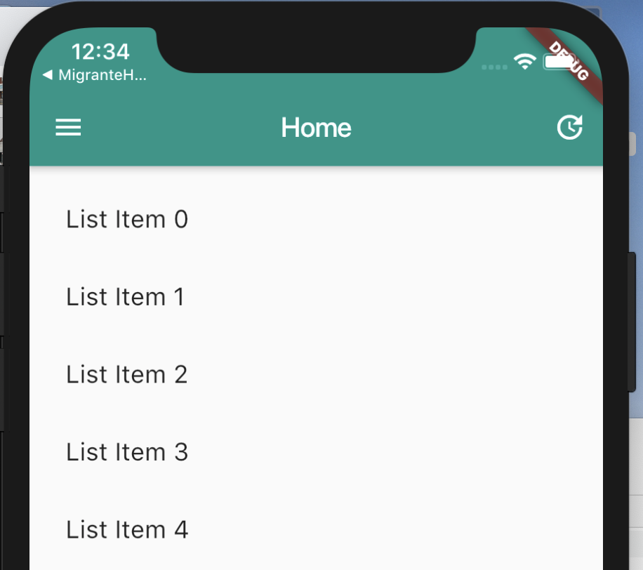
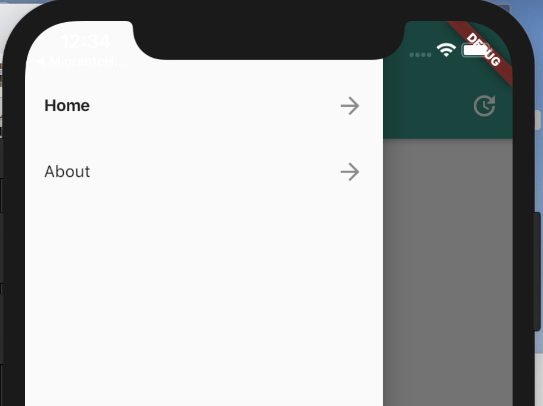
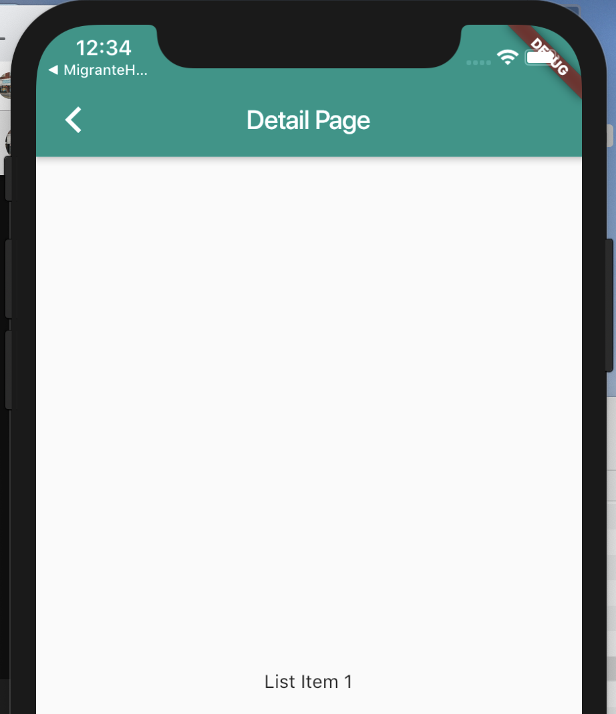
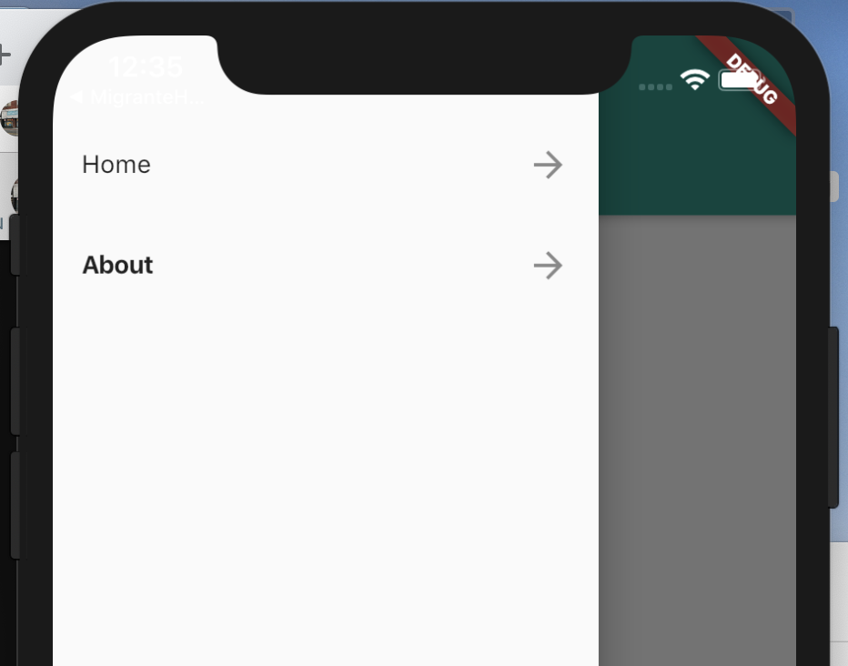

# Flutter Drawer with State Management

A new Flutter project demonstrating a pattern for managing state between the drawers in the application and using one widget to represent the drawer across multiple application pages

## Getting Started

- install the Provider Package from https://pub.dev/
- The Provider Package
  - A dependency injection system built with widgets for widgets. provider is mostly syntax sugar for InheritedWidget, to make common use-cases straightforward.
  - [Provider Package Documentation][1]
  
## What It Looks Like
<table border="0">
  <tr>
    <td></td>
    <td></td>
    <td></td>
    <td></td>
  </tr>  
  <tr center>
    <td  align="center"><p>Home Page</p></td>
    <td  align="center"><p>Drawer Showing Active Page</p></td>
    <td  align="center"><p>About Detail Page</p></td>
    <td  align="center"><p>Drawer Showing Active Page</p></td>
  </tr>   
</table>

## Quick Overview of Code

Create a separate widget for the drawer and just use in anywhere you need to.

Manage the Drawer State with a [Provider to Manage State][1]
- [Flutter ChangeNotifier Documentation](https://api.flutter.dev/flutter/foundation/ChangeNotifier-class.html)
- [Flutter notifyListeners method Documentation](https://api.flutter.dev/flutter/foundation/ChangeNotifier/notifyListeners.html)

this class contains state information and the appropriate methods to modify the state. When state updates happen, the call to [`notifyListeners`](https://api.flutter.dev/flutter/foundation/ChangeNotifier/notifyListeners.html) is call to let the application know the the appropriate widgets need to be redrawn
```dart
class DrawerStateInfo with ChangeNotifier {
  int _currentDrawer = 0;
  int get getCurrentDrawer => _currentDrawer;

  void setCurrentDrawer(int drawer) {
    _currentDrawer = drawer;
    notifyListeners();
  }

  void increment() {
    notifyListeners();
  }
}
```
Adding State Management to the Widget tree
- [Flutter MultiProvider Documentation](https://pub.dev/documentation/provider/latest/provider/MultiProvider-class.html)
```dart
class MyApp extends StatelessWidget {
  // This widget is the root of your application.
  @override
  Widget build(BuildContext context) {
    return MultiProvider(
      child: MaterialApp(
        title: 'Flutter Demo',
        theme: ThemeData(
          primarySwatch: Colors.teal,
        ),
        home: MyHomePage(title: 'Flutter Demo Home Page'),
      ),
      providers: <SingleChildCloneableWidget>[
        ChangeNotifierProvider<DrawerStateInfo>(
            builder: (_) => DrawerStateInfo()),
      ],
    );
  }
}
```


Creating The Drawer Widget for reuse in application. We are tracking the state to specify which item is the active item in the menu and then based on that we are updating the styling of the menu item's title

- [Flutter Drawer Widget Documentation](https://api.flutter.dev/flutter/material/Drawer-class.html)
```dart
class MyDrawer extends StatelessWidget {
  MyDrawer(this.currentPage);

  final String currentPage;

  @override
  Widget build(BuildContext context) {
    var currentDrawer = Provider.of<DrawerStateInfo>(context).getCurrentDrawer;
    return Drawer(
      child: ListView(
        children: <Widget>[
          ListTile(
            title: Text(
              "Home",
              style: currentDrawer == 0
                  ? TextStyle(fontWeight: FontWeight.bold)
                  : TextStyle(fontWeight: FontWeight.normal),
            ),
            trailing: Icon(Icons.arrow_forward),
            onTap: () {
              Navigator.of(context).pop();
              if (this.currentPage == "Home") return;

              Provider.of<DrawerStateInfo>(context).setCurrentDrawer(0);

              Navigator.of(context).pushReplacement(MaterialPageRoute(
                  builder: (BuildContext context) =>
                      MyHomePage(title: "Home")));
            },
          ),
          ListTile(
            title: Text(
              "About",
              style: currentDrawer == 1
                  ? TextStyle(fontWeight: FontWeight.bold)
                  : TextStyle(fontWeight: FontWeight.normal),
            ),
            trailing: Icon(Icons.arrow_forward),
            onTap: () {
              Navigator.of(context).pop();
              if (this.currentPage == "About") return;

              Provider.of<DrawerStateInfo>(context).setCurrentDrawer(1);

              Navigator.of(context).pushReplacement(MaterialPageRoute(
                  builder: (BuildContext context) => MyAboutPage()));
            },
          ),
        ],
      ),
    );
  }
}

```

Use of Drawer in one of your pages; when using the Drawer, we specify the name of the Drawer when creating the instance. This should probably be a constant or maybe even an object containing addition information but this works for the example.
```dart
class MyAboutPage extends StatefulWidget {
  @override
  _MyAboutPageState createState() => _MyAboutPageState();
}

class _MyAboutPageState extends State<MyAboutPage> {
  @override
  Widget build(BuildContext context) {
    return Scaffold(
      appBar: AppBar(
        title: Text('About Page'),
      ),
      drawer: MyDrawer("About"),
    );
  }
}
```


  [1]: https://pub.dev/packages/provider


A few resources to get you started if this is your first Flutter project:

- [Lab: Write your first Flutter app](https://flutter.io/docs/get-started/codelab)
- [Cookbook: Useful Flutter samples](https://flutter.io/docs/cookbook)

For help getting started with Flutter, view our 
[online documentation](https://flutter.io/docs), which offers tutorials, 
samples, guidance on mobile development, and a full API reference.
